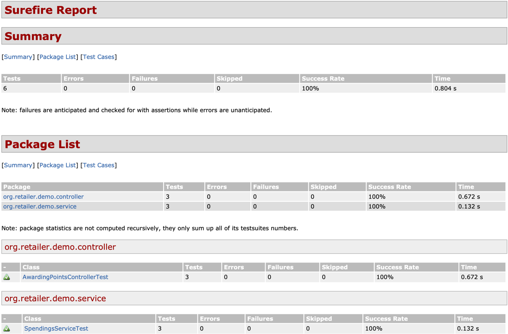
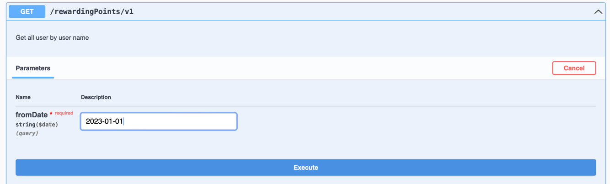
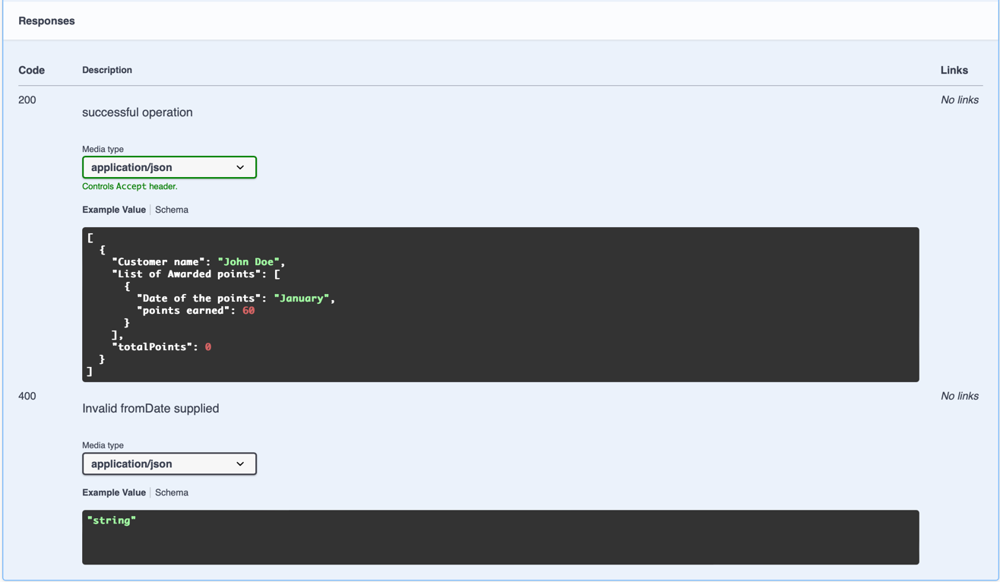
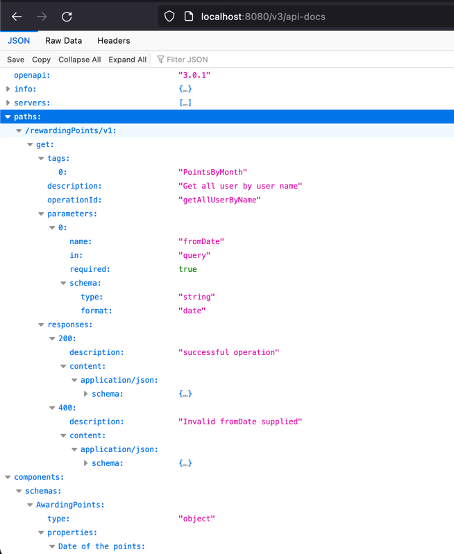

# Demo Awarding Points

# Pre-requisites
- [java >= 17] (http://www.oracle.com/technetwork/java/javase/downloads/index.html)
- [maven >= 3.3] (https://maven.apache.org/download.cgi)

# How to develop locally on my laptop?
----------------------

Reference your home directory as HOME_DIR below since Java is platform independent and does not recognize Unix tilde *~* shortcut.

### Checkout the code
```
cd HOME_DIR 
mkdir src
cd src
git clone https://github.com/marco31415/demoAwardingPoints.git
```

### Setup Your Java IDE
This section will describe how to setup your Java IDE so you can debug and develop the code. There are two options for IDE. Eclipse or IntelliJ

#### IntelliJ IDE
##### Run and Import Code
1. Click on Import Project and select your HOME_DIR/demoAwardingPoints folder
2. Click on Import project from external model and choose Maven
3. Click Next->Finish and wait for import to complete.

##### Run the WebAPI Server
1. Click on Search
2. In *Search String* box type *App* and hit the *Search* button
3. In the *Search* tab at the bottom right click *main(String[])*
4. In the pop up-menu select Run as—>Run Configuration—>Java Applications
5. Click *Run* and the web server will start
6. Confirm that is running by hitting http://localhost:8080/actuator/health


#### Eclipse IDE
##### Run and Import Code
1. Click on File->Import->Existing Maven Projects->Next
2. Click on Browse and select your HOME_DIR/demoAwardingPoints folder
3. Click on Finish and wait for import to complete.

##### Run the WebAPI Server
1. Click on Search->Java
2. In *Search String* box type *App* and hit the *Search* button
3. In the *Search* tab at the bottom right click *main(String[])*
4. In the pop up-menu select Run as—>Run Configuration—>Java Applications
5. Click the tab “Arguments”
6. Click *Run* and the web server will start
7. Confirm that is running by hitting http://localhost:8080/actuator/health

# How to run from docker container?
----------------------
### Build the jar file
1. From HOME_DIR/demoAwardingPoints folder run
```
mvn clean install
```
2. You should be logged into your docker hub account to build the image with the next command
```
docker build -t myorg/myapp .
```
3. then you can run the image with the next command
```
docker run -p 8080:8080 myorg/myapp
```
4. Confirm that is running by hitting http://localhost:8080/actuator/health

# How to run unit test?
---------------------
### mvn test
In the root project folder, run "mvn clean test". This will run all the unit tests.

### Surefire Report
You can execute the next command to generate the surefire report.
```
mvn surefire-report:report
```
You can find the surefire report in the target folder ${basedir}/target/site/surefire-report.html. The report is in HTML format and can be viewed in any browser:



# How to monitor the application?
-------------------------------
All CORE Services using the standard urls below for monitoring.

| Service        |                  Url                   |  Purpose |
| ------------- |:--------------------------------------:| :------------: |
| Health Check | http://localhost:8080/actuator/health  | Performs a real time health check of the server |
| Performance | http://localhost:8080/actuator/metrics | Get real time performance metrics of DB, APIs, etc.. |
| Stack Trace |   http://localhost:8080/actuator/threaddump    | Gets the stack trace of all threads on the server |

# Sample API Calls
---------------------

### Request
```
http://localhost:8080/rewardingPoints/v1?fromDate=2023-01-01
curl --location 'http://localhost:8080/rewardingPoints/v1?fromDate=2023-01-01'
```
### Response
```
[
  {
    "customerName": "John Doe",
    "awardedPoints": [
      {
        "date": "2023-01-01 / 2023-01-31",
        "points": 30
      },
      {
        "date": "2023-02-01 / 2023-02-28",
        "points": 100
      },
      {
        "date": "2023-03-01 / 2023-03-31",
        "points": 280
      }
    ],
    "totalPoints": 410
  },
  {
    "customerName": "Jane Doe",
    "awardedPoints": [
      {
        "date": "2023-01-01 / 2023-01-31",
        "points": 70
      },
      {
        "date": "2023-02-01 / 2023-02-28",
        "points": 960
      },
      {
        "date": "2023-03-01 / 2023-03-31",
        "points": 1260
      }
    ],
    "totalPoints": 2290
  }
]
```
### You can access the Swagger UI to try the API at the following URL
```
http://localhost:8080/swagger-ui/index.html
```
Request:

Response:


### The OpenAPI description will be available at the following URL in JSON format
```
http://localhost:8080/v3/api-docs
```



### Or in YAML format
```
http://localhost:8080/v3/api-docs.yaml
```

# Example dataset
---------------------
### Customers:

| Id  |   Name   |
|-----|:--------:|
| 1   | John Doe |
| 2   | Jane Doe |

### Transactions:

|Customer |	Spending |	Amount |	Date|
|---------|:---------:|:-------:|:---:|
|John Doe |	magazines |	$60 |	2023-01-01|
|John Doe |	candy |	$70 |	2023-01-15|
|John Doe |	shoes |	$80 |	2023-02-01|
|John Doe |	suit |	$110 |	2023-02-15|
|John Doe |	door |	$80 |	2023-03-01|
|John Doe |	play station |	$200 |	2023-03-15|
|Jane Doe |	shoes |	$80 |	2023-01-01|
|Jane Doe |	dinner |	$90 |	2023-01-15|
|Jane Doe |	dress |	$130 |	2023-02-01|
|Jane Doe |	phone |	$500 |	2023-02-15|
|Jane Doe |	tv |	$600 |	2023-03-01|
|Jane Doe |	make up |	$180 |	2023-03-15|

### Monthly total:

| Customer |	Month |	Total Points|
|----------|:-----:|:-----------:|
| John Doe |	Jan |	30|
| John Doe |	Feb |	100|
| John Doe |	Mar |	280|
|          |total |	410|
| Jane Doe |	Jan |	70|
| Jane Doe |	Mar |	960|
| Jane Doe |	Mar |	1260|
|          | total    |	2290|